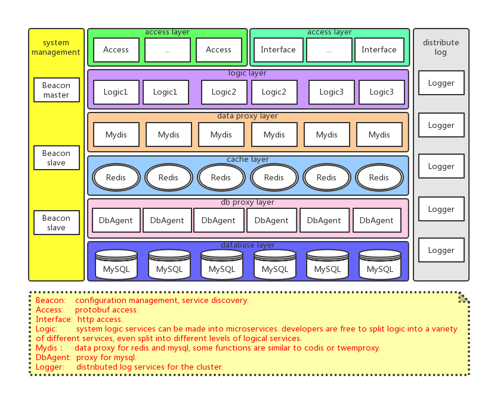

English | [中文](/README_cn.md)
# NebulaBootstrap: a distributed systems solution build on nebula.
    

1. [Overview](#Overview)
2. [License](#License)
3. [Building](#Building)
4. [Documentation](#Documentation)
5. [Depend on](#DependOn)
6. [Todo list](#TODO)
7. [Change log](#ChangeLog)

## Overview 

NebulaBootstrap provides service for developers to quickly build a distributed systems (including configuration management, service discovery, routing, load balancing, leadership election, distributed sessions, cluster state and so on). 

## License 

MIT License

>  Copyright (c) 2018 Bwar
>
>  Permission is hereby granted, free of charge, to any person obtaining a copy
>  of this software and associated documentation files (the "Software"), to deal
>  in the Software without restriction, including without limitation the rights
>  to use, copy, modify, merge, publish, distribute, sublicense, and/or sell
>  copies of the Software, and to permit persons to whom the Software is
>  furnished to do so, subject to the following conditions:
>
>  The above copyright notice and this permission notice shall be included in
>  all copies or substantial portions of the Software.
>
>  THE SOFTWARE IS PROVIDED "AS IS", WITHOUT WARRANTY OF ANY KIND, EXPRESS OR
>  IMPLIED, INCLUDING BUT NOT LIMITED TO THE WARRANTIES OF MERCHANTABILITY,
>  FITNESS FOR A PARTICULAR PURPOSE AND NONINFRINGEMENT. IN NO EVENT SHALL THE
>  AUTHORS OR COPYRIGHT HOLDERS BE LIABLE FOR ANY CLAIM, DAMAGES OR OTHER
>  LIABILITY, WHETHER IN AN ACTION OF CONTRACT, TORT OR OTHERWISE, ARISING FROM,
>  OUT OF OR IN CONNECTION WITH THE SOFTWARE OR THE USE OR OTHER DEALINGS IN
>  THE SOFTWARE.

## Building 
   NebulaBootstrap was consist of [NebulaBeacon](https://github.com/Bwar/NebulaBeacon), [NebulaHttp](https://github.com/Bwar/NebulaHttp), [NebulaAccess](https://github.com/Bwar/NebulaAccess), [NebulaLogic](https://github.com/Bwar/NebulaLogic), NebulaStorage, NebulaDbAgent and NebulaLogger, and they were builded passing with gcc6.4 on centos6.5(upgrade binutils to 2.22 or later) and centos7.4.  
   
  build step：
   1. $ mkdir NebulaDepend
   2. go to [Depend on](#DependOn), download and compile these dependent libraries, copy the shared library files to NebulaDepend/lib, copy the header files directory to NebulaDepend/include.
   3. $ cd NebulaBeacon/src;    $ make
   4. $ cd NebulaAccess/src;    $ make
   5. $ cd NebulaLogic/src;    $ make

    # my work path was "/home/bwar/factory"
    mkdir BuildNebula
    cd BuildNebula
     
    # build nebula depend
    mkdir NebulaDepend NebulaDependBuild
    cd NebulaDependBuild
    
    git clone https://github.com/google/protobuf.git protobuf
    cd protobuf
    ./autogen.sh
    ./configure --prefix=/home/bwar/factory/BuildNebula/NebulaDepend
    make
    make install
    cd ..
    
    git clone https://github.com/kindy/libev.git libev
    cd libev/src
    chmod u+x autogen.sh
    ./autogen.sh
    ./configure --prefix=/home/bwar/factory/BuildNebula/NebulaDepend
    make
    make install
    cd ../../
    
    git clone https://github.com/redis/hiredis.git hiredis
    cd hiredis
    make
    mkdir ../../NebulaDepend/include/hiredis
    cp -r adapters *.h ../../NebulaDepend/include/hiredis/
    cp libhiredis.so ../../NebulaDepend/lib/
    cd ..
    
    wget https://github.com/weidai11/cryptopp/archive/CRYPTOPP_6_0_0.tar.gz
    tar -zxvf CRYPTOPP_6_0_0.tar.gz
    cd cryptopp-CRYPTOPP_6_0_0
    make libcryptopp.so
    mkdir ../../NebulaDepend/include/cryptopp
    cp *.h ../../NebulaDepend/include/cryptopp/
    cp libcryptopp.so ../../NebulaDepend/lib/
    cd ..
    
    # build nebula
    cd ..
    git clone https://github.com/Bwar/Nebula.git Nebula
    cd Nebula/proto
    /home/bwar/factory/BuildNebula/NebulaDepend/bin/protoc *.proto --cpp_out=../src/pb
    cd ../src
    make

## Documentation 
   The complete documentation for NebulaBootstrap is coming...
    

## Depend on 
   * [protobuf](https://github.com/google/protobuf)
   * [libev](https://github.com/kindy/libev)
   * [hiredis](https://github.com/redis/hiredis)
   * [crypto++](http://www.cryptopp.com)
   * [Nebula](https://github.com/Bwar/Nebula) 

## Todo list 
   - June 2018:    NebulaLogger online, NebulaDbAgent online.
   - July 2018:    NebulaAccess online, NebulaStorage online.
   - Auguest 2018: NebulaBootstrap documentation.

## Change log 
#### v0.3
   - the first runable version

 

